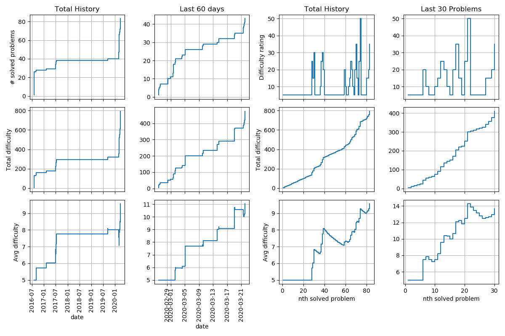

# project-euler-scraper

A scraper for Project Euler Problems data and User Progression data.

# Introduction

Project Euler (https://projecteuler.net/) currently offers more than 700 math problems. It quickly gets hard to decide which problems to solve. The goal of this program is 
* to facilitate this decision, by building an easy-to-manipulate table with project euler problems' data.
* to help a project euler account user to visualize her/his progression, by creating a set of progress visualizations.


# Installation and First Run

To install and run first the algorithm a first time, run :

```shell
git clone [ssh key of the repo]
cd project-euler-scraper
python setup.py install
python pescraper/main.py
```


# How to include User Progression

By default, **user progression is not included**. To add it to the output table, please add a Project Euler history txt file in a `./data` directory. To download this txt file, please go to https://projecteuler.net/progress;show=history and click on the link under the table. Then, run `pescraper/main.py` again.


# Output

The output of the algorithm is double : a csv table (./result/project-euler-problems.csv) and a graph (./result/project-euler-progression.png).

## Structure of csv Table

The **table** contains the following data for each problem :
1. number (int) : id of the problem
2. title (str)
3. description (str) : official problem description
4. Published on (date) : date of publication of the problem on the website
5. Solved By (int) : number of users that solved the problem
6. Difficulty Rating (int) : indicator of the problem difficulty, from 5 to 100.

If User Progression data is available, two columns are added :
7. Solved On (datetime) : datetime at which the problem was solved. If the problem has not been solved yet, set to None. 
8. Solved (boolean) : True if the user solved the problem. 

This table can be used for instance:
* to find all the yet unsolved problems with a given difficulty
* to find all the problems which title or description contain a given keyword (*prime* or *roman numeral* for example).

## Example of graph output

Here is an example of **graph** created with this algorithm :



By default, the algorithm will show the activity of the last 60 days and 30 problems, but these two numbers can be set when calling the algorithm by running `main.py -d <n_days> -p <n_prob>`


# Notes

* The algorithm uses multithreading to speed up the download of the problems' data.
* Depending on your machine, the whole algorithm should take about a minute to run.
